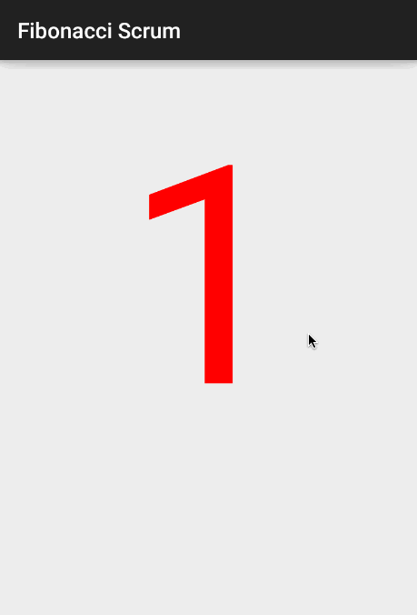

# Fibonacci-Scrum
Android app which dislays Fibonacci numbers, useful during scrum planning

Time Spent: 2hrs

###Walkthrough

###**Features:**
  1. Swipe left to get next number in Fibonacci series
  2. Swipe right to get previous number in Fibonacci series
  3. When number is greater than 100 then shows infinity and asks user to break down the story into smaller more manageble tasks
